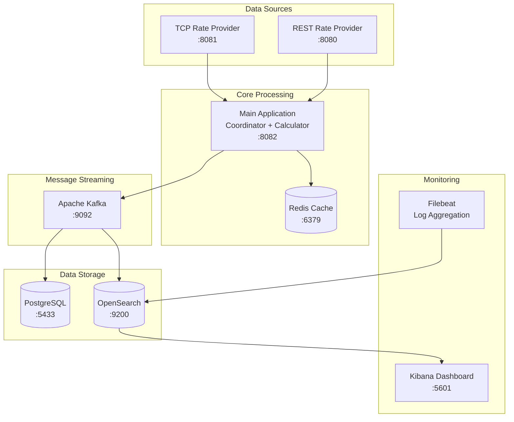

# 🚀 Toyota Forex Real-Time Data Processing System

<div align="center">


*Enterprise-grade real-time forex data processing pipeline with microservices architecture*

</div>
<!-- Screenshot eklemek için -->


---

## 📋 Table of Contents

- [🎯 Project Overview](#-project-overview)
- [🏗️ System Architecture](#️-system-architecture)
- [🚀 Quick Start](#-quick-start)
- [📦 Services](#-services)
- [🔧 Configuration](#-configuration)
- [📊 Monitoring & Dashboards](#-monitoring--dashboards)
- [🐛 Troubleshooting](#-troubleshooting)
- [📚 Documentation](#-documentation)

---

## 🎯 Project Overview

A comprehensive **real-time forex data processing system** built with microservices architecture. The system collects forex rates from multiple sources (REST API & TCP), processes them through a sophisticated calculation pipeline, and stores results in multiple databases for analysis and monitoring.

### ✨ Key Features

- 🔄 **Real-time Data Processing** - Live forex rate collection and processing
- 🏗️ **Microservices Architecture** - 5+ independent, scalable services  
- 📊 **Multi-Storage Strategy** - PostgreSQL, Redis cache, OpenSearch indexing
- 🔍 **Advanced Monitoring** - Real-time dashboards with Kibana
- 🧮 **Smart Calculations** - AVG and CROSS rate calculations with pipeline processing
- 🐳 **Containerized Deployment** - Full Docker Compose orchestration
- 📈 **Pipeline Tracking** - End-to-end transaction tracking with unique pipeline IDs

---

## 🏗️ System Architecture



### 🔄 Data Flow

1. **Collection**: REST/TCP providers generate live forex rates
2. **Coordination**: Main application coordinates data flow and calculations  
3. **Processing**: Real-time pipeline calculates AVG/CROSS rates
4. **Streaming**: Kafka distributes processed data to consumers
5. **Storage**: PostgreSQL (persistence) + OpenSearch (analytics)
6. **Monitoring**: Kibana dashboards for real-time insights


## 🚀 Quick Start

### Prerequisites

- 🐳 **Docker & Docker Compose** (v20+)
- 💻 **8GB+ RAM** recommended
- 🌐 **Ports**: 5601, 8080-8082, 9092, 9200, 6379, 5433

### ⚡ One-Command Setup

```bash
# 1. Clone the repository
git clone https://github.com/fatihkaratash/toyota.git
cd toyota

# 2. Create environment file
cp .env.example .env

# 3. Start the entire system
docker-compose up --build -d

# 4. Wait for services to initialize (2-3 minutes)
docker-compose ps
```

### ✅ Verify Installation

```bash
# Check all services are running
docker-compose ps

# Expected output: 8 services running
# ✅ rest-rate-provider      Up    0.0.0.0:8080->8080/tcp
# ✅ tcp-rate-provider       Up    0.0.0.0:8081->8081/tcp  
# ✅ main-application        Up    0.0.0.0:8082->8082/tcp
# ✅ kafka                   Up    0.0.0.0:9092->9092/tcp
# ✅ redis                   Up    0.0.0.0:6379->6379/tcp
# ✅ postgres               Up    0.0.0.0:5433->5432/tcp
# ✅ opensearch             Up    0.0.0.0:9200->9200/tcp
# ✅ dashboard                 Up    0.0.0.0:5601->5601/tcp
```

---

## 📦 Services

| Service | Port | Description | Health Check |
|---------|------|-------------|--------------|
| 🌐 **REST Provider** | 8080 | HTTP forex rate API | `curl http://localhost:8080/` |
| 🔌 **TCP Provider** | 8081 | TCP socket rate streaming | `docker logs tcp-rate-provider` |
| 🧠 **Main Application** | 8082 | Coordinator & Calculator | `curl http://localhost:8082/actuator/health` |
| 📨 **Kafka** | 29092 | Message streaming | `docker exec kafka kafka-topics --list --bootstrap-server localhost:29092` |
| ⚡ **Redis** | 6379 | High-speed cache | `docker exec redis redis-cli ping` |
| 🗄️ **PostgreSQL** | 5433 | Rate persistence | `docker exec postgres pg_isready` |
| 🔍 **OpenSearch** | 9200 | Search & analytics | `curl http://localhost:9200/_cluster/health` |
| 📊 **Kibana** | 5601 | Monitoring dashboard | `curl http://localhost:5601/api/status` |

---

## 🔧 Configuration

### Environment Variables (.env)

```env
# Database Configuration
POSTGRES_USER=postgres
POSTGRES_PASSWORD=pgadmin
POSTGRES_DB=toyota_rates

# Provider Authentication
REST_PROVIDER_USER=admin
REST_PROVIDER_PASSWORD=admin123
TCP_PROVIDER_USER=tcpuser
TCP_PROVIDER_PASSWORD=tcp123?

# Market Trend Configuration
MARKET_TREND_INITIAL_MODE=NEUTRAL
MARKET_TREND_INITIAL_STRENGTH=0.5
TREND_REDIS_POLL_INTERVAL_SECONDS=10

# Processing Configuration
MAX_RETRY_ATTEMPTS=3
INITIAL_RETRY_DELAY_MS=1000
RETRY_BACKOFF_MULTIPLIER=2.0
READ_TIMEOUT_SECONDS=30
```

### 🎛️ Advanced Configuration

- **Kafka Topics**: Auto-created on startup
- **Database Schema**: Auto-migrated with Flyway
- **OpenSearch Indices**: Auto-configured by consumers
- **Calculation Rules**: Defined in `main-application/src/main/resources/calculation-config.json`

---

## 📊 Monitoring & Dashboards

### 🔥 opensearch Dashboards

Access OpenSearch at **http://localhost:5601**
<!-- Dashboard screenshot -->


#### 📈 Pre-configured Dashboards:

1. **Real-time Rates** - Live forex rate monitoring
2. **Pipeline Tracking** - End-to-end transaction flow
3. **System Health** - Service performance metrics
4. **Error Analysis** - Failed transactions and alerts

#### 🔍 Index Patterns:

```bash
# Create these index patterns in Kibana:
financial-simple-rates     # Clean user-facing rates
financial-raw-rates        # Raw provider data  
financial-calculated-rates # AVG/CROSS calculations
financial-logs-*          # Application logs
```

### 🔧 Data Inspection Tools

```bash
# PostgreSQL Database
docker exec -it postgres psql -U postgres -d toyota_rates
# Commands: \dt, SELECT * FROM rates LIMIT 10;

# Redis Cache
docker exec -it redis redis-cli
# Commands: KEYS *, GET toyota_rates:calc:EURUSD_AVG

# Kafka Topics
docker exec -it kafka kafka-console-consumer \
  --bootstrap-server localhost:29092 \
  --topic financial-simple-rates --from-beginning

# OpenSearch Indices
curl "http://localhost:9200/financial-simple-rates/_search?pretty"
```

---

## 🐛 Troubleshooting

### 🚨 Common Issues

<details>
<summary><b>Services fail to start</b></summary>

```bash
# Check system resources
docker system df
docker system prune -f

# Restart problematic services
docker-compose restart main-application
docker-compose logs main-application
```
</details>

<details>
<summary><b>No data in dashboards</b></summary>

```bash
# Verify data flow
docker logs main-application | grep "Pipeline"
docker logs kafka-consumer | grep "processed"

# Check Kafka topics
docker exec kafka kafka-topics --list --bootstrap-server localhost:9092
```
</details>

<details>
<summary><b>Memory issues</b></summary>

```bash
# Reduce memory usage in docker-compose.yml
# OpenSearch: OPENSEARCH_JAVA_OPTS=-Xms256m -Xmx256m
# Kafka: KAFKA_HEAP_OPTS=-Xmx512m

docker-compose down
docker-compose up -d
```
</details>

### 📋 Health Check Commands

```bash
# Full system health check
./scripts/health-check.sh

# Individual service logs
docker-compose logs -f [service-name]

# Service restart
docker-compose restart [service-name]
```

---

## 📚 Documentation

### 🎯 Key Endpoints

```bash
# Rate Providers
GET  http://localhost:8080/rates/current    # REST provider rates
GET  http://localhost:8080/actuator/health  # REST provider health

# Main Application  
GET  http://localhost:8082/actuator/health  # Main app health
GET  http://localhost:8082/metrics          # Application metrics

# Infrastructure
GET  http://localhost:9200/_cluster/health  # OpenSearch cluster
GET  http://localhost:5601/api/status       # Kibana status
```

### 🏗️ Project Structure

```
toyota-forex-system/
├── 📂 data-providers/
│   ├── rest-rate-provider/     # HTTP API rate provider
│   └── tcp-rate-provider/      # TCP socket rate provider
├── 📂 main-application/        # Core processing engine
├── 📂 kafka-consumer/          # PostgreSQL persistence
├── 📂 kafka-consumer-opensearch/ # OpenSearch indexing
├── 📂 filebeat/               # Log aggregation config
├── 📂 postgres-init-scripts/  # Database initialization
├── 📂 logs/                   # Application logs
├── 🐳 docker-compose.yml      # Service orchestration
└── 📋 .env                    # Environment configuration
```

### 🔗 Related Documentation

- [Kafka Topics & Message Formats](./docs/kafka-topics.md)
- [Database Schema](./docs/database-schema.md)
- [API Documentation](./docs/api-documentation.md)
- [Pipeline Processing Logic](./docs/pipeline-processing.md)

---

## 🤝 Contributing

1. Fork the repository
2. Create a feature branch (`git checkout -b feature/amazing-feature`)
3. Commit changes (`git commit -m 'Add amazing feature'`)
4. Push to branch (`git push origin feature/amazing-feature`)
5. Open a Pull Request

---

## 📜 License

This project is licensed under the MIT License - see the [LICENSE](LICENSE) file for details.

---

## 🙏 Acknowledgments

- Built with modern microservices architecture
- Leverages enterprise-grade technologies
- Designed for scalability and maintainability

---

<div align="center">

**⭐ Star this repository if you find it helpful!**

Made with ❤️ for real-time data processing
email : f.karatash.dev@gmail.com

</div>